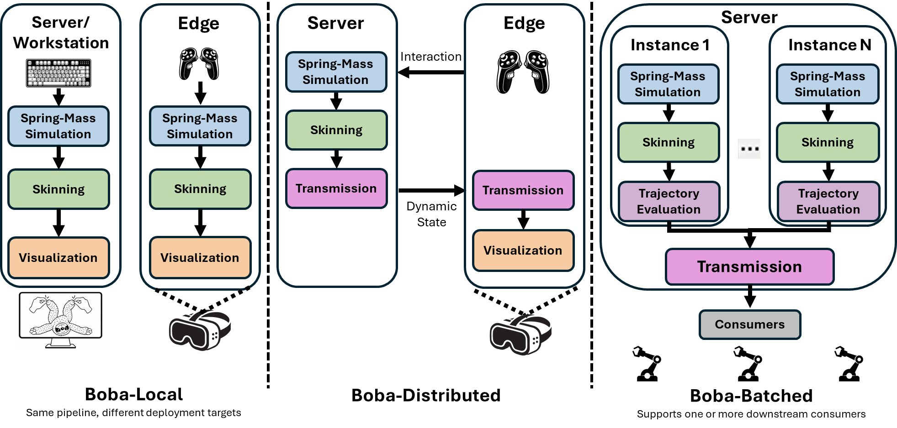

# Boba: Batched Simulation for Physics-Based Gaussian Digital Twins (ECCV 2026)

**Accepted to ECCV 2026.**

[Project Page](https://jianxiapyh.github.io/Boba-project-page/) | [Paper](https://rsim.cs.illinois.edu/Pubs/Boba_ECCV.pdf)

## News

- **August 17, 2026 — Post-acceptance solver update.** Boba now defaults to
  PyTorch 2.12.1 with CUDA 13.2 and cuSOLVER. For Boba's batched 3x3
  eigendecompositions, this replaces the paper-era CUDA 12/MAGMA path that
  copied matrices to the CPU for LAPACK and copied the results back to the GPU.
  It also removes the large-batch `torch.linalg.eigh` matrix-count failure
  observed with the initial CUDA 13.0/cuSOLVER stack. Repeating the measurements
  in the paper on an NVIDIA RTX PRO 6000 Blackwell GPU, the updated stack reaches
  an average maximum capacity of 1,489 instances and a largest-case maximum of
  2,819, while increasing average aggregate throughput by 13.5% (from 3,530 to
  4,008 FPS).

> This repository contains the source code for Boba, and this branch currently includes `Boba-Local` and `Boba-Batched`.
> For `Boba-Distributed`, switch to the future `Boba-Distributed` branch and follow the README there.

Boba is based on PhysTwin. In this branch, the main public paths are `Boba-Local` and `Boba-Batched`, corresponding to the system designs shown below.

This branch contains the spring-mass simulation and skinning pipeline described in the paper, together with the rendering optimizations used for the visualization path. `Boba-Distributed` and its transmission optimizations will be documented in the future `Boba-Distributed` branch.

## System Designs



- `Boba-Local`: single-instance spring-mass simulation, skinning, and visualization.
- `Boba-Batched`: batched spring-mass simulation and skinning, with headless and rendered benchmark paths.
- `Boba-Distributed`: planned as a separate public branch.
- In this branch, `batch_size=1` / `instance=1` follows the `Boba-Local` equivalent path.

## Setup

### Recommended CUDA 13.2 environment

```bash
conda env create -f env_install/phystwin-cu132.yml
conda activate phystwin-cu132
./env_install/build_cuda13_extensions.sh
conda deactivate
conda activate phystwin-cu132
```

The examples below use `phystwin-cu132`. Run Boba commands from that activated
environment or via:

```bash
conda run -n phystwin-cu132 env PYTHONNOUSERSITE=1 python ...
```

<details>
<summary>Prerequisites and system requirements</summary>

- Linux on an NVIDIA GPU
- CUDA-compatible driver and toolkit
- Linux build tools for compiled extensions
- Desktop OpenGL / X11 for interactive windowed runs
- A valid `DISPLAY` when launching rendering paths

On a minimal Ubuntu/NVIDIA machine, install system packages such as
`build-essential`, `libglfw3`, `libglfw3-dev`, and the usual desktop OpenGL / X11
runtime libraries before continuing.

For production linear algebra, Boba always selects cuSOLVER. There is no
runtime backend-selection environment variable and no MAGMA fallback.

</details>

<details>
<summary>CUDA 13.2 build and compatibility details</summary>

The current branch requires the `phystwin-cu132` interpreter and PyTorch
built with CUDA 13.2 or newer on every GPU. CUDA 12 and `phystwin-cu130`
environments are no longer supported by this branch; their manifests are
retained only as historical records. Use an older commit to reproduce an
older software stack.

Boba validates that runtime imports resolve to its vendored `gsplat` copy.
The extension installer builds `simple-knn`, `fused-ssim`, PyCUDA with OpenGL
support and vendored `gsplat`, and warms the dedicated cuSOLVER 3x3 binding.
It verifies the pinned PyTorch/CUDA versions. Runtime activation hooks derive
library paths from `CONDA_PREFIX`; reactivate the environment after building.

The builder detects visible GPU capabilities and compiles matching cubins.
For a headless build or a machine with additional deployment GPUs, supply an
explicit numeric architecture list:

```bash
TORCH_CUDA_ARCH_LIST="8.9;12.0+PTX" ./env_install/build_cuda13_extensions.sh
```

CUDA inference now calls `syevjBatched` directly in one batch on every GPU,
including RTX 3090, RTX 4090 and Blackwell, avoiding the generic solver's
large temporary workspace. The physical solver and LBS formulas are
unchanged. cuSOLVER is fixed; `BOBA_LINALG_BACKEND` does not override it.
See [solver behavior, build and validation notes](gaussian_splatting/CUSOLVER.md).

</details>

## Required Assets

Download each archive below and extract it at the repository root:

- [`data`](https://drive.google.com/file/d/1aNse_gijcxVkolD4_PLD4fxXNQfuKkK-/view?usp=drive_link)
- [`experiments`](https://drive.google.com/file/d/1dAUMfyojdSKp2dc5aMhXNUVfTJMj7W76/view?usp=drive_link)
- [`experiments_optimization`](https://drive.google.com/file/d/1MMRpFHpN47nhXc3nZxfWwpnnDp2ITCw5/view?usp=drive_link)
- [`gaussian_output`](https://drive.google.com/file/d/1ZtYBj0tEGNLppcSAzt9r-oVUdSAdMHnN/view?usp=drive_link)
- [`gaussian_output_pruned_policy_30_55`](https://drive.google.com/file/d/1nDpWimKg8hsFaXwzo7MdceGN1HQS3c02/view?usp=drive_link)

Expected layout:

```text
data/
experiments/
experiments_optimization/
gaussian_output/
gaussian_output_pruned_policy_30_55/
```

## Run Boba-Local

Performance mode:

```bash
conda run -n phystwin-cu132 env PYTHONNOUSERSITE=1 python interactive_playground.py --mode perf --case_name double_lift_cloth_3
```

Quality mode:

```bash
conda run -n phystwin-cu132 env PYTHONNOUSERSITE=1 python interactive_playground.py --mode quality --case_name double_lift_cloth_3
```

<details>
<summary>Quality evaluation and PhysTwin comparison details</summary>

`quality` mode is the single-instance evaluation path with calibrated multi-view rendering.
It writes `inference.pkl` and rendered frames under `results/quality/<case>/`.
For quality comparison against the original PhysTwin paper numbers, use one camera view.
The quality script defaults to PhysTwin-style render aggregation:

```bash
conda run -n phystwin-cu132 env PYTHONNOUSERSITE=1 bash benchmarks/Boba_Local_single_inst_quality.sh --num_views 1
```

Render evaluation supports two `OVERALL` aggregation modes:
- `phystwin`: PhysTwin-compatible mode. `OVERALL` is averaged over every evaluated frame/view sample directly, so longer sequences contribute more samples.
- `scene_mean`: Equal-scene summary mode. This is often the fairer Boba summary because each scene/case sequence gets equal weight in the final `OVERALL` row.

Here, `scene` means one data sequence/case such as `double_lift_cloth_1`, and `view` means one calibrated camera view. `--num_views 2` and `--num_views 3` are Boba multi-view extensions; use `--num_views 1` for one-to-one comparison with original PhysTwin paper numbers.

</details>

## Run Boba-Batched

Headless spring-mass + LBS batch scaling:

```bash
conda run -n phystwin-cu132 env PYTHONNOUSERSITE=1 bash benchmarks/run_sim_lbs_batch_scaling.sh --batch_sizes 1 2 4 8
```

Batched full runtime for one case:

```bash
conda run -n phystwin-cu132 env PYTHONNOUSERSITE=1 python benchmarks/run_batched_full_runtime_case.py \
  --case_name double_lift_cloth_3 \
  --batch_size 4 \
  --batched_render_variant batch_optimized
```

<details>
<summary>Autotuning, per-instance rendering, and multi-case runs</summary>

Headless spring-mass + LBS best-throughput search for one case:

```bash
conda run -n phystwin-cu132 env PYTHONNOUSERSITE=1 bash benchmarks/run_sim_lbs_best_throughput.sh single_lift_rope
```

This autotune benchmark searches batch sizes automatically instead of requiring a fixed `--batch_sizes` list.
It reports the best measured instance count, batch FPS, and throughput under `results/batch_autotune/`.

```bash
NUM_RUNS=1 MAX_BATCH_SIZE=256 REFINE_SAMPLES=9 REFINE_ROUNDS=2 FINAL_DENSE_WINDOW=8 \
  conda run -n phystwin-cu132 env PYTHONNOUSERSITE=1 bash benchmarks/run_sim_lbs_best_throughput.sh single_lift_rope
```

Render one instance and save a video:

```bash
conda run -n phystwin-cu132 env PYTHONNOUSERSITE=1 python benchmarks/run_batched_full_runtime_case.py \
  --case_name double_lift_cloth_3 \
  --batch_size 4 \
  --render_mode instance \
  --instance_id 2 \
  --save_video
```

Batched full runtime across cases:

```bash
conda run -n phystwin-cu132 env PYTHONNOUSERSITE=1 bash benchmarks/run_batched_full_runtime.sh --batch_size 4 --batched_render_variant batch_optimized
conda run -n phystwin-cu132 env PYTHONNOUSERSITE=1 bash benchmarks/run_batched_full_runtime.sh --batch_size 4 --render_mode instance --instance_id 2 --save_video
```

</details>

## Boba-Distributed

`Boba-Distributed` will be documented in the future `Boba-Distributed` branch. Use the README in that branch for the setup and execution commands for the distributed design.

## Benchmark Scripts

For the full benchmark entrypoint reference, including every script option,
environment override, and output layout, see
[`benchmarks/README.md`](benchmarks/README.md).

<details>
<summary>Common benchmark commands and defaults</summary>

Full-runtime performance benchmark:

```bash
conda run -n phystwin-cu132 env PYTHONNOUSERSITE=1 bash benchmarks/Boba_Local_single_inst_perf.sh
```

Full-runtime quality benchmark:

```bash
conda run -n phystwin-cu132 env PYTHONNOUSERSITE=1 bash benchmarks/Boba_Local_single_inst_quality.sh
```

PhysTwin-compatible render reporting for paper-number comparison:

```bash
conda run -n phystwin-cu132 env PYTHONNOUSERSITE=1 bash benchmarks/Boba_Local_single_inst_quality.sh --num_views 1
```

Headless sim+LBS batch-scaling benchmark:

```bash
conda run -n phystwin-cu132 env PYTHONNOUSERSITE=1 bash benchmarks/run_sim_lbs_batch_scaling.sh --batch_sizes 1 2 4 8
```

Headless sim+LBS best-throughput autotune benchmark:

```bash
conda run -n phystwin-cu132 env PYTHONNOUSERSITE=1 bash benchmarks/run_sim_lbs_best_throughput.sh single_lift_rope
```

Batched full-runtime benchmark:

```bash
conda run -n phystwin-cu132 env PYTHONNOUSERSITE=1 bash benchmarks/run_batched_full_runtime.sh --batch_size 4 --batched_render_variant batch_optimized
```

Batched full-runtime scaling benchmark:

```bash
DISPLAY=:1 conda run -n phystwin-cu132 env PYTHONNOUSERSITE=1 bash benchmarks/run_batched_full_runtime_batch_scaling.sh --batch_sizes 1 2 4 8 16 32 64
```

Defaults when unspecified:
- `render_mode=batch_images`
- `num_views=1`
- `overall_mode=phystwin`
- `save_video=false`
- `NUM_RUNS=3`
- best-throughput autotune: `NUM_RUNS=1`, `MAX_BATCH_SIZE=256`, `REFINE_SAMPLES=9`, `REFINE_ROUNDS=2`, `FINAL_DENSE_WINDOW=8`

This path still requires an X11/OpenGL display because the full-runtime renderer creates a GLFW window.

</details>

## Outputs

- `results/perf`: full-runtime performance summaries and logs
- `results/quality`: rendered outputs, evaluation artifacts, and metrics
- `results/batch_scaling`: headless sim+LBS batch-scaling outputs
- `results/batch_autotune`: best-throughput search outputs, including `best_throughput_table.csv` and `candidate_table.csv`
- `results/batched_render`: batched full-runtime render and benchmark outputs

## Citation

If you find Boba useful, please cite:

```bibtex
@inproceedings{pang2026boba,
  title     = {Boba: Batched Simulation for Physics-Based Gaussian Digital Twins},
  author    = {Pang, Yihan and Jiang, Hanxiao and Kondguli, Sushant and Adve, Sarita and Wang, Shenlong},
  booktitle = {European Conference on Computer Vision (ECCV)},
  year      = {2026}
}
```

## License

Except where otherwise noted, Boba is licensed under the
[Apache License 2.0](LICENSE). See [NOTICE](NOTICE) for attribution information.
Vendored third-party software retains its original license; consult the license
files distributed with those components.
